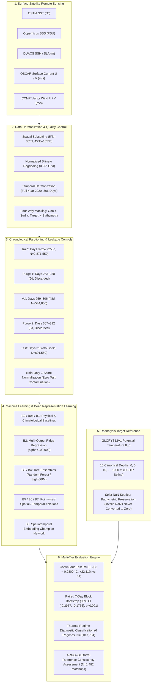
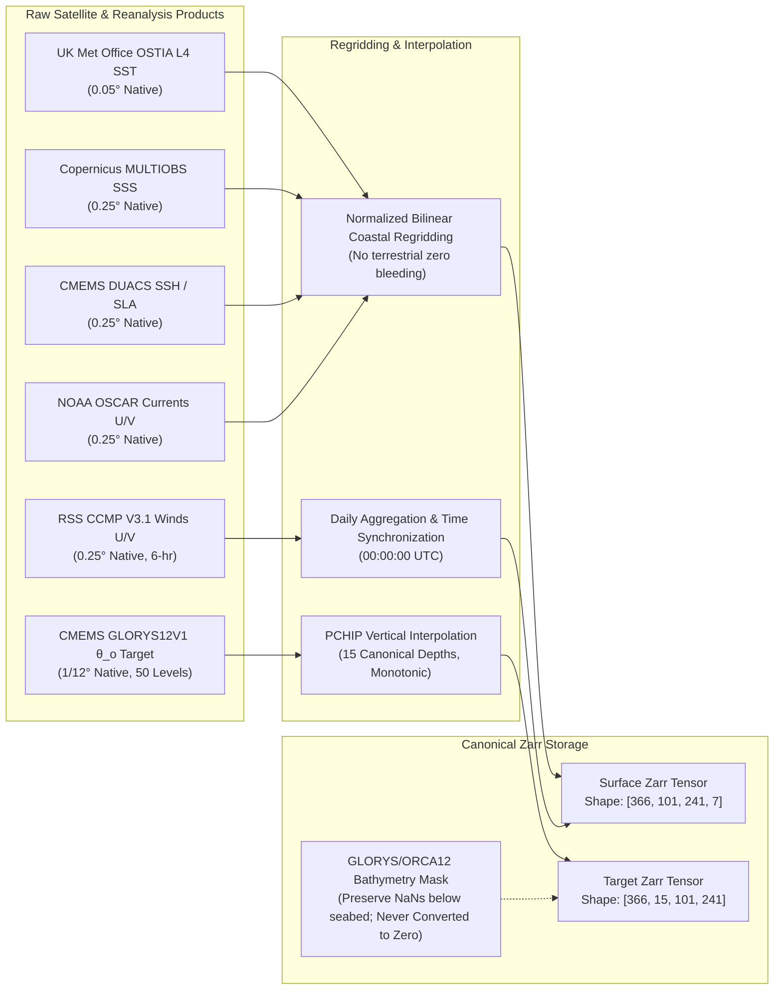
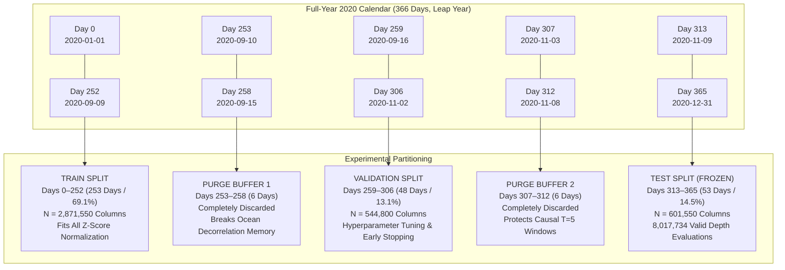
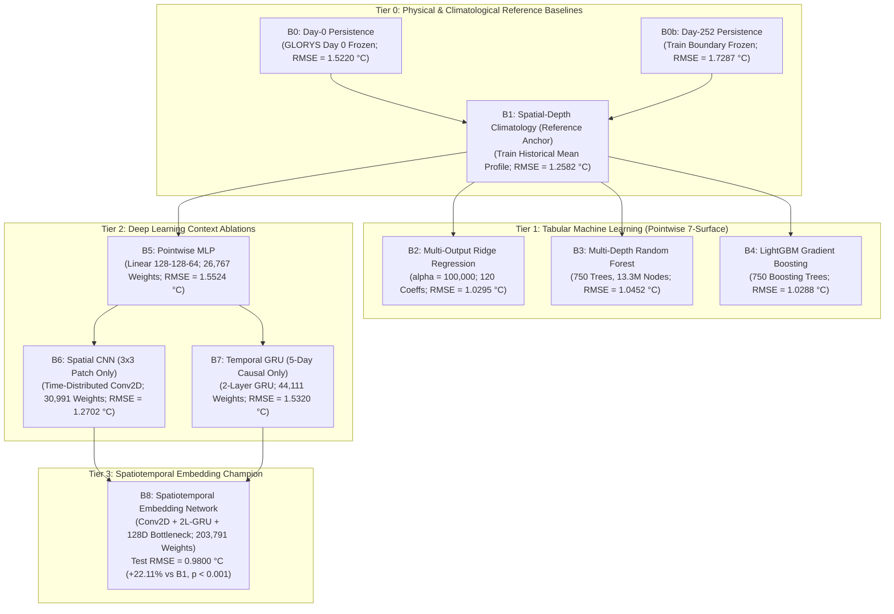
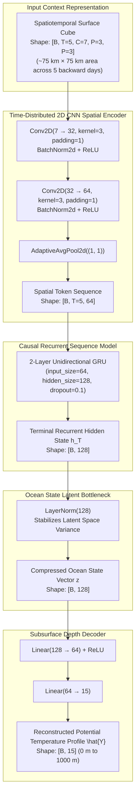
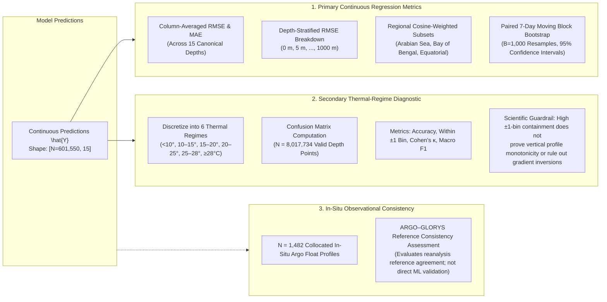

# Publication-Quality Architectural & Workflow Diagrams
## Satellite Embedding-Based Deep Learning Framework for Reconstruction of Depth-Wise Subsurface Ocean Temperature

---

### Diagram 1: End-to-End Scientific System Pipeline

---

### Diagram 2: Data-Source Integration & Preprocessing Flow

---

### Diagram 3: Chronological Split & Purge Buffer Architecture

---

### Diagram 4: Ten-Model Benchmark Hierarchy (B0 to B8)

---

### Diagram 5: Champion B8 Architecture Detailed Topology

---

### Diagram 6: Comprehensive Evaluation & Diagnostic Workflow

